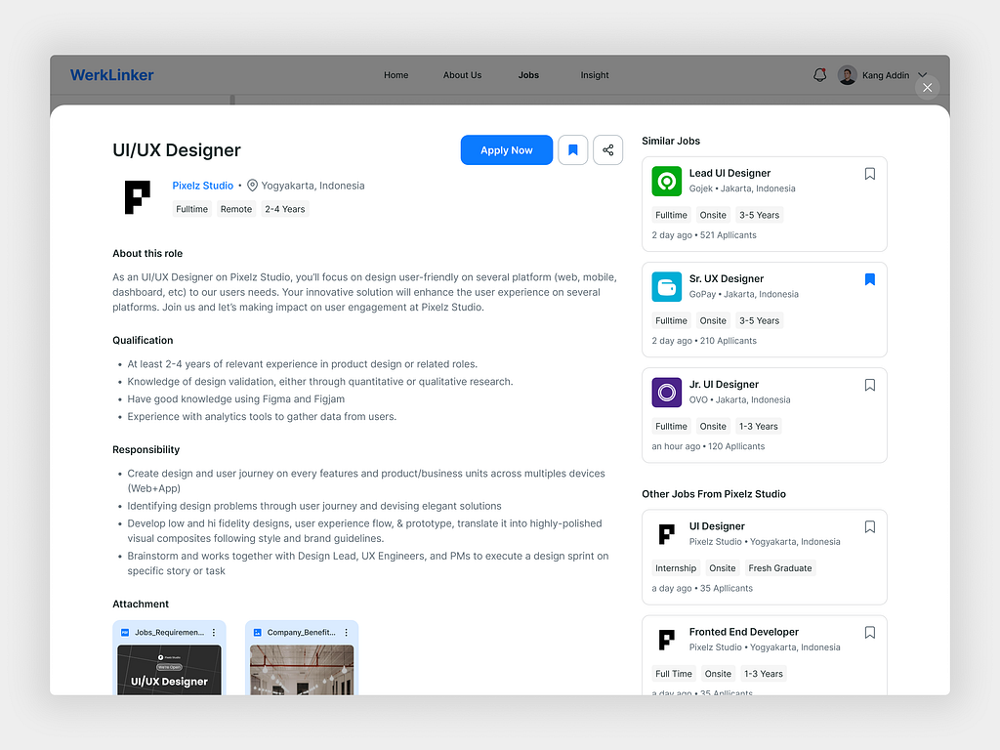

# Table of Contents

- [Table of Contents](#table-of-contents)
  - [Project Overview](#project-overview)
    - [Backend](#backend)
    - [Frontend](#frontend)
  - [Recruiter \[Features and Previews\]](#recruiter-features-and-previews)
  - [Job Seeker \[Features and Previews\]](#job-seeker-features-and-previews)
  - [Project References](#project-references)
    - [Running the Project](#running-the-project)
    - [Contributing](#contributing)
    - [License](#license)

## Project Overview

This project is a MERN stack application, utilizing MongoDB, Express.js, React, and Node.js. The project is structured with a `backend` and `client` directory, each containing their respective components and functionalities.

### Backend

The backend is located in the `backend` directory. It is responsible for:

- **API endpoints:** Defining the API routes and handling requests.
- **Database interactions:** Connecting to the MongoDB database and performing CRUD operations.
- **Authentication:** Handling user login and registration.
- **Data validation:** Ensuring that data is valid before it is stored in the database.

### Frontend

The frontend is located in the `client` directory. It is responsible for:

- **User interface:** Building the user interface using React components.
- **Data fetching:** Making API requests to the backend to retrieve data.
- **State management:** Managing the application state using React hooks.
- **Routing:** Handling navigation between different pages.

## Recruiter [Features and Previews]

- **Create jobs from different companies.**
  
- **Recruiter dashboard (recent applicants, recent jobs, status data in number).**
  
- **Check candidate's resume using inbuilt resume.**
  
- **View applicants in each jobs.**
  
- **Update candidate status (interviewing, hired, applied, reviewing).**
  
- **Invite user using codes.**
  

## Job Seeker [Features and Previews]

- **Infinite joblist scroll, JobFilters mobile responsiveness, Apply and view jobs.**  
  
- **Bookmarked job.**
  
- **View applied job**
  
- **Job Details Drawer**
  
- **Resume builder using data inputs.**
  

## Project References

- **[[Inspiration for Job listings](https://dribbble.com/shots/21587286-Job-Search-Platform)]**
  
- **[Recruiter Dashboard]**
  
- **[Candidate Status]**
  
- **[Job Details Drawer]**
  

### Running the Project

To run the project, follow these steps:

1. **Install dependencies:**

   ```bash
   cd backend
   npm install
   cd ../client
   npm install
   ```

2. **Set up environment variables:**

   ```bash
   cd backend
   cp .env.example .env
   cd ../client
   cp .env.example .env
   ```

3. **Start the backend server:**

   ```bash
   cd backend
   npm start
   ```

4. **Start the frontend development server:**
   ```bash
   cd client
   npm run dev
   ```

The frontend will be accessible at `http://localhost:3000`.
The backend will be accessible at `http://localhost:8000`.

### Contributing

Contributions are welcome! Please open an issue or submit a pull request.

### License

This project is licensed under the MIT License.
